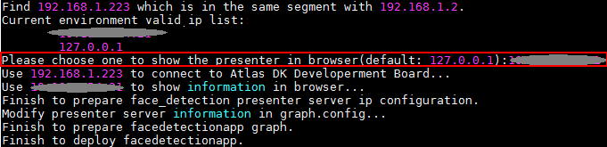
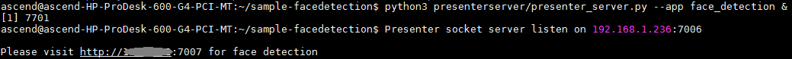
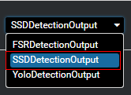

中文|[英文](README.md)

开发者可以将本application部署至Atlas 200DK上实现对摄像头数据的实时采集、并对视频中的人脸信息进行预测的功能。

## 前提条件<a name="zh-cn_topic_0167071573_section137245294533"></a>

部署此Sample前，需要准备好以下环境：

-   已完成MindSpore Studio的安装，详细请参考[MindSpore Studio安装指南](https://www.huawei.com/minisite/ascend/cn/filedetail_1.html)。
-   已完成Atlas 200 DK开发者板与MindSpore Studio的连接，交叉编译器的安装，SD卡的制作及基本信息的配置等，详细请参考[Atlas 200 DK使用指南](https://www.huawei.com/minisite/ascend/cn/filedetail_2.html)。

## 软件准备<a name="zh-cn_topic_0167071573_section081240125311"></a>

运行此Sample前，需要按照此章节获取源码包，并进行相关的环境配置。

1.  获取源码包。

    将[https://github.com/Ascend/sample-facedetection](https://github.com/Ascend/sample-facedetection)仓中的代码以MindSpore Studio安装用户下载至MindSpore Studio所在Ubuntu服务器的任意目录，例如代码存放路径为：_/home/ascend/sample-facedetection_。

2.  以MindSpore Studio安装用户登录MindSpore Studio所在Ubuntu服务器，并设置环境变量DDK\_HOME。

    **vim \~/.bashrc**

    执行如下命令在最后一行添加DDK\_HOME及LD\_LIBRARY\_PATH的环境变量。

    **export DDK\_HOME=/home/XXX/tools/che/ddk/ddk**

    **export LD\_LIBRARY\_PATH=$DDK\_HOME/uihost/lib**

    > **说明：**   
    >-   XXX为MindSpore Studio安装用户，/home/XXX/tools为DDK默认安装路径。  
    >-   如果此环境变量已经添加，则此步骤可跳过。  

    输入:wq!保存退出。

    执行如下命令使环境变量生效。

    **source \~/.bashrc**


## 部署<a name="zh-cn_topic_0167071573_section7994174585917"></a>

1.  以MindSpore Studio安装用户进入facedetectionapp应用代码所在根目录，如/home/ascend/sample-facedetection。
2.  <a name="zh-cn_topic_0167071573_li08019112542"></a>执行部署脚本，进行工程环境准备，包括ascenddk公共库的编译与部署、网络模型的下载、Presenter Server服务器的配置等操作。

    **bash deploy.sh** _host\_ip_ _model\_mode_

    -   _host\_ip_：Atlas 200 DK开发者板的IP地址。
    -   model\_mode代表模型文件及依赖软件的部署方式，默认为internet。
        -   local：若MindSpore Studio所在Ubuntu系统未连接网络，请使用local模式，执行此命令前，需要参考[网络模型及公共代码库下载](#zh-cn_topic_0167071573_section4995103618210)将网络模型文件以及依赖的公共代码库下载到“sample-facedetection/script“目录下。
        -   internet：若MindSpore Studio所在Ubuntu系统已连接网络，请使用internet模式，在线下载模型文件及依赖代码库。


    命令示例：

    **bash deploy.sh 192.168.1.2 internet**

    当提示“Please choose one to show the presenter in browser\(default: 127.0.0.1\):“时，请输入在浏览器中访问Presenter Server服务所使用的IP地址（一般为访问MindSpore Studio的IP地址。）

    如[图1](#zh-cn_topic_0167071573_fig184321447181017)所示，请在“Current environment valid ip list“中选择通过浏览器访问Presenter Server服务使用的IP地址。

    **图 1**  工程部署示意图<a name="zh-cn_topic_0167071573_fig184321447181017"></a>  
    

3.  <a name="zh-cn_topic_0167071573_li499911453439"></a>启动Presenter Server。

    执行如下命令在后台启动Face Detection应用的Presenter Server主程序。

    **python3 presenterserver/presenter\_server.py --app face\_detection &**

    > **说明：**   
    >“presenter\_server.py“在当前目录的“presenterserver“目录下，可以在此目录下执行**python3 presenter\_server.py -h**或者**python3 presenter\_server.py --help**查看“presenter\_server.py“的使用方法。  

    如[图2](#zh-cn_topic_0167071573_fig69531305324)所示，表示presenter\_server的服务启动成功。

    **图 2**  Presenter Server进程启动<a name="zh-cn_topic_0167071573_fig69531305324"></a>  
    

    使用上图提示的URL登录Presenter Server，仅支持Chrome浏览器。IP地址为[2](#zh-cn_topic_0167071573_li08019112542)中输入的IP地址，端口号默为7007，如下图所示，表示Presenter Server启动成功。

    **图 3**  主页显示<a name="zh-cn_topic_0167071573_fig64391558352"></a>  
    


## 运行<a name="zh-cn_topic_0167071573_section551710297235"></a>

1.  运行Face Detection程序。

    在**sample-facedetection**目录下执行如下命令运行Face Detection应用程序。

    **bash run\_facedetectionapp.sh** _host\_ip_ _presenter\_view\_app\_name  camera\_channel\_name_   &

    -   _host\_ip_ ：对于Atlas 200 DK开发者板，即为开发者板的IP地址。
    -   _presenter\_view\_app\_name_：用户自定义的在PresenterServer界面展示的View Name。
    -   _camera\_channel\_name_：摄像头所属Channel，取值为“Channel-1“或者“Channel-2“，查询摄像头所属Channel的方法请参考[Atlas 200 DK使用指南](https://www.huawei.com/minisite/ascend/cn/filedetail_2.html)中的“常用操作 > 如何查询摄像头所属Channel”。

    命令示例：

    **bash run\_facedetectionapp.sh 192.168.1.2 video Channel-1 &**

2.  使用启动Presenter Server服务时提示的URL登录 Presenter Server 网站，详细可参考[3](#zh-cn_topic_0167071573_li499911453439)。

    等待Presenter Agent传输数据给服务端，单击“Refresh“刷新，当有数据时相应的Channel 的Status变成绿色，如[图4](#zh-cn_topic_0167071573_fig113691556202312)所示。

    **图 4**  Presenter Server界面<a name="zh-cn_topic_0167071573_fig113691556202312"></a>  
    

    > **说明：**   
    >-   Face Detection的Presenter Server最多支持10路Channel同时显示，每个 _presenter\_view\_app\_name_ 对应一路Channel。  
    >-   由于硬件的限制，每一路支持的最大帧率是20fps，受限于网络带宽的影响，帧率会自动适配为较低的帧率进行展示。  

3.  单击右侧对应的View Name链接，比如上图的“video”，查看结果，对于检测到的人脸，会给出置信度的标注。

## 后续处理<a name="zh-cn_topic_0167071573_section177619345260"></a>

-   **停止Face Detection应用**

    Face Detection应用执行后会处于持续运行状态，若要停止Face Detection应用程序，可执行如下操作。

    以MindSpore Studio安装用户在 _**/home/ascend/sample-facedetection**_ 目录下执行如下命令：

    **bash stop\_facedetectionapp.sh** _host\_ip_

    _host\_ip_：对于Atlas 200 DK开发者板，即为开发者板的IP地址。。

    命令示例：

    **bash stop\_facedetectionapp.sh 192.168.1.2**

-   **停止Presenter Server服务**

    Presenter Server服务启动后会一直处于运行状态，若想停止Face Detection应用对应的Presenter Server服务，可执行如下操作。

    以MindSpore Studio安装用户在MindSpore Studio所在服务器中执行如下命令查看Face Detection应用对应的Presenter Server服务的进程。

    **ps -ef | grep presenter | grep face\_detection**

    ```
    ascend@ascend-HP-ProDesk-600-G4-PCI-MT:~/sample-facedetection$ ps -ef | grep presenter | grep face_detection
    ascend    7701  1615  0 14:21 pts/8    00:00:00 python3 presenterserver/presenter_server.py --app face_detection
    ```

    如上所示 _7701_ 即为face\_detection应用对应的Presenter Server服务的进程ID。

    若想停止此服务，执行如下命令：

    **kill -9** _7701_


## 网络模型及公共代码库下载<a name="zh-cn_topic_0167071573_section4995103618210"></a>

-   网络模型文件下载

    Face Detection sample中使用的模型是经过转化后的适配Ascend 310芯片的模型。可参考[表1](#zh-cn_topic_0167071573_table0531392153)进行模型文件的下载。如果您有更好的模型，欢迎上传到[https://github.com/Ascend/models](https://github.com/Ascend/models)进行分享。

    将模型文件（.om文件）下载到“sample-facedetection/script“目录下。

    **表 1**  Face Detection中使用模型

    <a name="zh-cn_topic_0167071573_table0531392153"></a>
    <table><thead align="left"><tr id="zh-cn_topic_0167071573_row1154103991514"><th class="cellrowborder" valign="top" width="19.55%" id="mcps1.2.5.1.1"><p id="zh-cn_topic_0167071573_p195418397155"><a name="zh-cn_topic_0167071573_p195418397155"></a><a name="zh-cn_topic_0167071573_p195418397155"></a>模型名称</p>
    </th>
    <th class="cellrowborder" valign="top" width="30%" id="mcps1.2.5.1.2"><p id="zh-cn_topic_0167071573_p1054539151519"><a name="zh-cn_topic_0167071573_p1054539151519"></a><a name="zh-cn_topic_0167071573_p1054539151519"></a>模型说明</p>
    </th>
    <th class="cellrowborder" valign="top" width="31.96%" id="mcps1.2.5.1.3"><p id="zh-cn_topic_0167071573_p387083117108"><a name="zh-cn_topic_0167071573_p387083117108"></a><a name="zh-cn_topic_0167071573_p387083117108"></a>模型下载路径</p>
    </th>
    <th class="cellrowborder" valign="top" width="18.490000000000002%" id="mcps1.2.5.1.4"><p id="zh-cn_topic_0167071573_p35412397154"><a name="zh-cn_topic_0167071573_p35412397154"></a><a name="zh-cn_topic_0167071573_p35412397154"></a>原始网络下载地址</p>
    </th>
    </tr>
    </thead>
    <tbody><tr id="zh-cn_topic_0167071573_row65414393159"><td class="cellrowborder" valign="top" width="19.55%" headers="mcps1.2.5.1.1 "><p id="zh-cn_topic_0167071573_p17544398153"><a name="zh-cn_topic_0167071573_p17544398153"></a><a name="zh-cn_topic_0167071573_p17544398153"></a>人脸检测网络模型</p>
    <p id="zh-cn_topic_0167071573_p84114461512"><a name="zh-cn_topic_0167071573_p84114461512"></a><a name="zh-cn_topic_0167071573_p84114461512"></a>（face_detection.om）</p>
    </td>
    <td class="cellrowborder" valign="top" width="30%" headers="mcps1.2.5.1.2 "><p id="zh-cn_topic_0167071573_p169011731015"><a name="zh-cn_topic_0167071573_p169011731015"></a><a name="zh-cn_topic_0167071573_p169011731015"></a>此模型是基于Caffe的Resnet10-SSD300模型转换后的网络模型。</p>
    <p id="zh-cn_topic_0167071573_p13241175715516"><a name="zh-cn_topic_0167071573_p13241175715516"></a><a name="zh-cn_topic_0167071573_p13241175715516"></a></p>
    </td>
    <td class="cellrowborder" valign="top" width="31.96%" headers="mcps1.2.5.1.3 "><p id="zh-cn_topic_0167071573_p1569513572242"><a name="zh-cn_topic_0167071573_p1569513572242"></a><a name="zh-cn_topic_0167071573_p1569513572242"></a>请从<a href="https://github.com/Ascend/models/" target="_blank" rel="noopener noreferrer">https://github.com/Ascend/models/</a>仓的computer_vision/object_detect/face_detection目录中下载。</p>
    <p id="zh-cn_topic_0167071573_p1787118315101"><a name="zh-cn_topic_0167071573_p1787118315101"></a><a name="zh-cn_topic_0167071573_p1787118315101"></a>对应版本说明请参考当前目录下的README.md文件。</p>
    </td>
    <td class="cellrowborder" valign="top" width="18.490000000000002%" headers="mcps1.2.5.1.4 "><p id="zh-cn_topic_0167071573_p1785381617217"><a name="zh-cn_topic_0167071573_p1785381617217"></a><a name="zh-cn_topic_0167071573_p1785381617217"></a>请参考<a href="https://github.com/Ascend/models/" target="_blank" rel="noopener noreferrer">https://github.com/Ascend/models/</a>仓的computer_vision/object_detect/face_detection目录下的README.md文件获取。</p>
    <p id="zh-cn_topic_0167071573_p1314312124919"><a name="zh-cn_topic_0167071573_p1314312124919"></a><a name="zh-cn_topic_0167071573_p1314312124919"></a><strong id="zh-cn_topic_0167071573_b1141243104917"><a name="zh-cn_topic_0167071573_b1141243104917"></a><a name="zh-cn_topic_0167071573_b1141243104917"></a>模型转换时注意事项：</strong></p>
    <p id="zh-cn_topic_0167071573_p53116302463"><a name="zh-cn_topic_0167071573_p53116302463"></a><a name="zh-cn_topic_0167071573_p53116302463"></a>转化时会提示转化失败，只需要在最后一层的下拉框中选择SSDDetectionOutput然后点击Retry重新转换即可。</p>
    <p id="zh-cn_topic_0167071573_p2070918516450"><a name="zh-cn_topic_0167071573_p2070918516450"></a><a name="zh-cn_topic_0167071573_p2070918516450"></a><a name="zh-cn_topic_0167071573_image1725195313454"></a><a name="zh-cn_topic_0167071573_image1725195313454"></a><span></span></p>
    </td>
    </tr>
    </tbody>
    </table>


-   公共代码库下载

    将依赖的软件库下载到“sample-facedetection/script“目录下。

    **表 2**  依赖代码库下载

    <a name="zh-cn_topic_0167071573_table1935612447166"></a>
    <table><thead align="left"><tr id="zh-cn_topic_0167071573_row1635554471616"><th class="cellrowborder" valign="top" width="33.33333333333333%" id="mcps1.2.4.1.1"><p id="zh-cn_topic_0167071573_p6355194441618"><a name="zh-cn_topic_0167071573_p6355194441618"></a><a name="zh-cn_topic_0167071573_p6355194441618"></a>模块名称</p>
    </th>
    <th class="cellrowborder" valign="top" width="33.33333333333333%" id="mcps1.2.4.1.2"><p id="zh-cn_topic_0167071573_p2355744151615"><a name="zh-cn_topic_0167071573_p2355744151615"></a><a name="zh-cn_topic_0167071573_p2355744151615"></a>模块描述</p>
    </th>
    <th class="cellrowborder" valign="top" width="33.33333333333333%" id="mcps1.2.4.1.3"><p id="zh-cn_topic_0167071573_p5355124415162"><a name="zh-cn_topic_0167071573_p5355124415162"></a><a name="zh-cn_topic_0167071573_p5355124415162"></a>下载地址</p>
    </th>
    </tr>
    </thead>
    <tbody><tr id="zh-cn_topic_0167071573_row535664410169"><td class="cellrowborder" valign="top" width="33.33333333333333%" headers="mcps1.2.4.1.1 "><p id="zh-cn_topic_0167071573_p5355144141615"><a name="zh-cn_topic_0167071573_p5355144141615"></a><a name="zh-cn_topic_0167071573_p5355144141615"></a>EZDVPP</p>
    </td>
    <td class="cellrowborder" valign="top" width="33.33333333333333%" headers="mcps1.2.4.1.2 "><p id="zh-cn_topic_0167071573_p2035512440166"><a name="zh-cn_topic_0167071573_p2035512440166"></a><a name="zh-cn_topic_0167071573_p2035512440166"></a>对DVPP接口进行了封装，提供对图片/视频的处理能力。</p>
    </td>
    <td class="cellrowborder" valign="top" width="33.33333333333333%" headers="mcps1.2.4.1.3 "><p id="zh-cn_topic_0167071573_p135519445169"><a name="zh-cn_topic_0167071573_p135519445169"></a><a name="zh-cn_topic_0167071573_p135519445169"></a><a href="https://github.com/Ascend/sdk-ezdvpp" target="_blank" rel="noopener noreferrer">https://github.com/Ascend/sdk-ezdvpp</a></p>
    <p id="zh-cn_topic_0167071573_p1135584401618"><a name="zh-cn_topic_0167071573_p1135584401618"></a><a name="zh-cn_topic_0167071573_p1135584401618"></a>下载后请保持文件夹名称为ezdvpp。</p>
    </td>
    </tr>
    <tr id="zh-cn_topic_0167071573_row14356144401615"><td class="cellrowborder" valign="top" width="33.33333333333333%" headers="mcps1.2.4.1.1 "><p id="zh-cn_topic_0167071573_p135610445162"><a name="zh-cn_topic_0167071573_p135610445162"></a><a name="zh-cn_topic_0167071573_p135610445162"></a>Presenter Agent</p>
    </td>
    <td class="cellrowborder" valign="top" width="33.33333333333333%" headers="mcps1.2.4.1.2 "><p id="zh-cn_topic_0167071573_p133561244131620"><a name="zh-cn_topic_0167071573_p133561244131620"></a><a name="zh-cn_topic_0167071573_p133561244131620"></a>与Presenter Server进行交互的API接口。</p>
    </td>
    <td class="cellrowborder" valign="top" width="33.33333333333333%" headers="mcps1.2.4.1.3 "><p id="zh-cn_topic_0167071573_p19356844151612"><a name="zh-cn_topic_0167071573_p19356844151612"></a><a name="zh-cn_topic_0167071573_p19356844151612"></a><a href="https://github.com/Ascend/sdk-presenter/tree/master/presenteragent" target="_blank" rel="noopener noreferrer">https://github.com/Ascend/sdk-presenter/tree/master/presenteragent</a></p>
    <p id="zh-cn_topic_0167071573_p83561244101613"><a name="zh-cn_topic_0167071573_p83561244101613"></a><a name="zh-cn_topic_0167071573_p83561244101613"></a>下载后请保持文件夹名称为presenteragent。</p>
    </td>
    </tr>
    <tr id="zh-cn_topic_0167071573_row16356944181617"><td class="cellrowborder" valign="top" width="33.33333333333333%" headers="mcps1.2.4.1.1 "><p id="zh-cn_topic_0167071573_p1935684461616"><a name="zh-cn_topic_0167071573_p1935684461616"></a><a name="zh-cn_topic_0167071573_p1935684461616"></a>tornado (5.1.0)</p>
    <p id="zh-cn_topic_0167071573_p13356444141613"><a name="zh-cn_topic_0167071573_p13356444141613"></a><a name="zh-cn_topic_0167071573_p13356444141613"></a>protobuf (3.5.1)</p>
    <p id="zh-cn_topic_0167071573_p103566440169"><a name="zh-cn_topic_0167071573_p103566440169"></a><a name="zh-cn_topic_0167071573_p103566440169"></a>numpy (1.14.2)</p>
    </td>
    <td class="cellrowborder" valign="top" width="33.33333333333333%" headers="mcps1.2.4.1.2 "><p id="zh-cn_topic_0167071573_p3356144401619"><a name="zh-cn_topic_0167071573_p3356144401619"></a><a name="zh-cn_topic_0167071573_p3356144401619"></a>Presenter Server依赖的Python库</p>
    </td>
    <td class="cellrowborder" valign="top" width="33.33333333333333%" headers="mcps1.2.4.1.3 "><p id="zh-cn_topic_0167071573_p5356114415163"><a name="zh-cn_topic_0167071573_p5356114415163"></a><a name="zh-cn_topic_0167071573_p5356114415163"></a>请自行搜索相关源进行安装。</p>
    </td>
    </tr>
    </tbody>
    </table>


